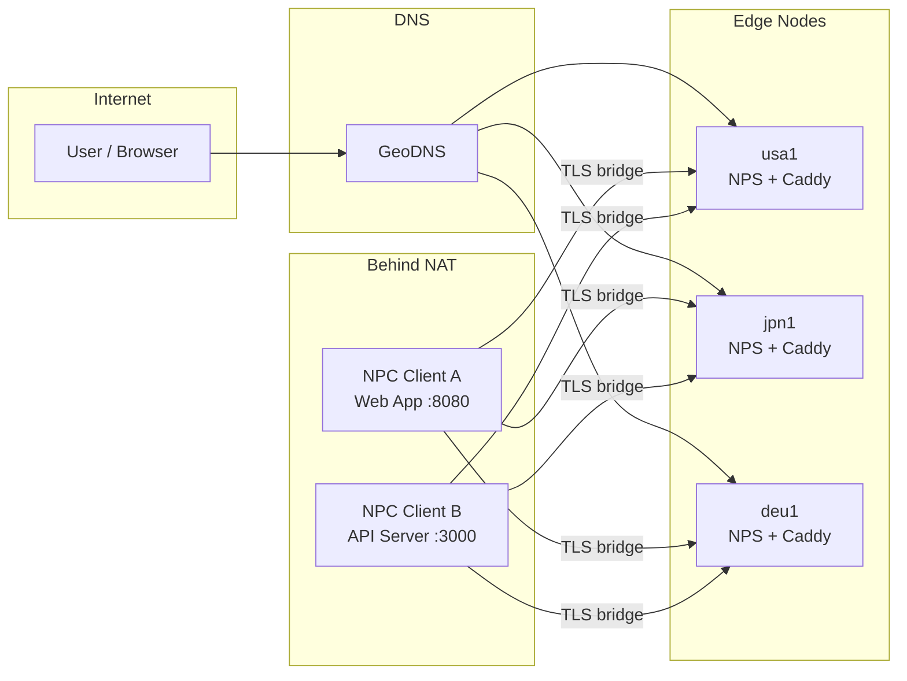

# Concepts

## What is NPS?

[NPS](https://github.com/djylb/nps) (Network Proxy Server) is a NAT traversal and reverse proxy tool. It allows you to expose services running behind NAT or firewalls to the public internet through relay servers. NPS supports TCP/UDP port forwarding, HTTP reverse proxying by domain name, SOCKS5 proxying, and more. nps-ctl targets the actively maintained [djylb/nps](https://github.com/djylb/nps) fork.

## Architecture

A typical NPS deployment places one or more **edge nodes** (NPS servers) on public-IP VPS instances. **NPC clients** run behind NAT on machines hosting the actual services. Users reach services through DNS, which resolves to the nearest edge. The edge's HTTP proxy or tunnel forwards traffic to the appropriate NPC client.

Each NPC client maintains persistent outbound connections (bridges) to all edge nodes. When a request arrives at any edge, NPS routes it through the bridge to the correct NPC client, which forwards it to the local service.

## Key terms

### Edge

An **edge** is an NPS server instance running on a VPS with a public IP address. It terminates TLS (typically via Caddy), accepts NPC bridge connections, and proxies incoming HTTP requests or tunnel traffic to the appropriate client. Each edge is identified by a unique `name` in `edges.toml`.

### Client (NPC)

An **NPC client** is a lightweight agent that runs on a machine behind NAT. It establishes outbound bridge connections to one or more edges, creating the tunnels through which traffic flows. Each client is identified by a **vkey** (verification key) and a human-readable name.

### Tunnel

A **tunnel** is a TCP or UDP port-forwarding rule. It maps a port on the edge server to a target address on the client's local network. For example, a TCP tunnel might forward `edge:8080` to `127.0.0.1:80` on the client machine. Tunnel types include `tcp`, `udp`, `socks5`, and `httpProxy`.

### Host mapping

A **host mapping** is an HTTP reverse proxy rule that routes requests for a specific domain name to a client and local port. For example, `app.example.com` can be mapped to client `my-server` at target `:8080`. Host mappings operate through the NPS HTTP proxy port (default 30080), typically fronted by Caddy for TLS termination.

### Bridge

The **bridge** is the persistent connection channel between an NPC client and an NPS edge. It can use TCP (port 51234 by default) or TLS (port 51235 by default). TLS bridges encrypt traffic between client and edge and are the recommended default.

### vkey

A **vkey** (verification key) is a unique string that identifies an NPC client to the NPS server. It is configured on both the server side (as a client entry in NPS) and the client side (in the NPC configuration). The vkey must match for the client to authenticate and connect.

## How nps-ctl fits

nps-ctl is a **cluster management layer** on top of NPS. Without nps-ctl, managing multiple NPS edges means logging into each server's web UI or making API calls individually. nps-ctl provides:

- **Single config, multiple edges** — one `edges.toml` file defines all your NPS servers. Commands like `host add` and `tunnel add` broadcast to all edges by default.
- **Cluster sync** — `edge sync` replicates clients, tunnels, and host mappings from a source edge to others, keeping all edges consistent.
- **NPC lifecycle management** — `client install`, `client upgrade`, and `client reconfig` deploy and manage NPC binaries on remote machines via SSH.
- **NPS deployment** — `edge install`, `edge upgrade`, and `edge reconfig` handle NPS server installation and configuration via SSH.

## Multi-edge architecture

Running multiple NPS edges across geographic regions provides two key benefits:

**Geographic distribution.** By placing edges in different regions (e.g., North America, Asia-Pacific, Europe) and using GeoDNS, users are routed to the nearest edge. This reduces latency for HTTP-proxied services.

**Redundancy.** If one edge goes down, DNS failover directs traffic to the remaining edges. Since NPC clients connect to all edges simultaneously, services remain reachable through any surviving edge without reconfiguration.

nps-ctl makes multi-edge operation practical by treating the cluster as a single unit. Adding a host mapping or client to one edge can automatically propagate to all others, and `edge sync` ensures consistency when edges drift.
