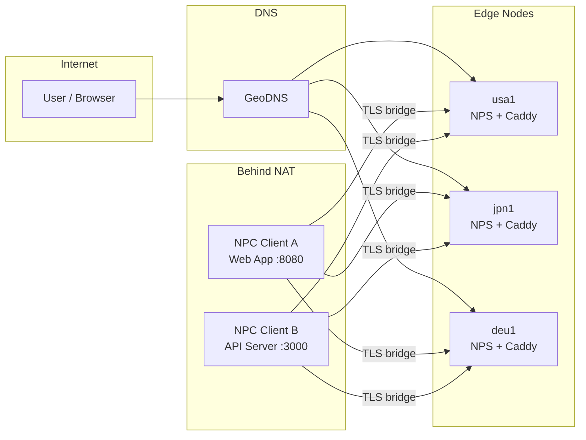

# 核心概念

## 什么是 NPS？

[NPS](https://github.com/djylb/nps)（Network Proxy Server）是一款 NAT 穿透与反向代理工具。它允许你通过中继服务器，将运行在 NAT 或防火墙后面的服务暴露到公网。NPS 支持 TCP/UDP 端口转发、基于域名的 HTTP 反向代理、SOCKS5 代理等功能。nps-ctl 针对的是活跃维护的 [djylb/nps](https://github.com/djylb/nps) 分支。

## 架构

典型的 NPS 部署会在具有公网 IP 的 VPS 实例上放置一个或多个 **边缘节点**（NPS 服务端）。**NPC 客户端** 运行在 NAT 后面托管实际服务的机器上。用户通过 DNS 访问服务，DNS 解析到最近的边缘节点，由边缘节点的 HTTP 代理或隧道将流量转发到相应的 NPC 客户端。

每个 NPC 客户端与所有边缘节点保持持久的出站连接（bridge）。当请求到达任一边缘节点时，NPS 通过 bridge 将请求路由到正确的 NPC 客户端，再由客户端转发到本地服务。

## 关键术语

### 边缘节点（Edge）

**边缘节点** 是运行在具有公网 IP 的 VPS 上的 NPS 服务端实例。它负责终止 TLS（通常通过 Caddy）、接受 NPC bridge 连接，并将传入的 HTTP 请求或隧道流量代理到相应的客户端。每个边缘节点在 `edges.toml` 中通过唯一的 `name` 标识。

### 客户端（NPC）

**NPC 客户端** 是一个轻量级代理程序，运行在 NAT 后面的机器上。它向一个或多个边缘节点发起出站 bridge 连接，建立流量传输的隧道。每个客户端通过一个 **vkey**（验证密钥）和一个可读名称来标识。

### 隧道（Tunnel）

**隧道** 是一条 TCP 或 UDP 端口转发规则，将边缘服务器上的端口映射到客户端本地网络上的目标地址。例如，一条 TCP 隧道可以将 `edge:8080` 转发到客户端机器上的 `127.0.0.1:80`。隧道类型包括 `tcp`、`udp`、`socks5` 和 `httpProxy`。

### 域名映射（Host Mapping）

**域名映射** 是一条 HTTP 反向代理规则，将特定域名的请求路由到指定的客户端和本地端口。例如，可以将 `app.example.com` 映射到客户端 `my-server` 的目标 `:8080`。域名映射通过 NPS HTTP 代理端口（默认 30080）工作，通常前置 Caddy 进行 TLS 终止。

### Bridge

**Bridge** 是 NPC 客户端与 NPS 边缘节点之间的持久连接通道。它可以使用 TCP（默认端口 51234）或 TLS（默认端口 51235）。TLS bridge 会加密客户端与边缘节点之间的流量，是推荐的默认方式。

### vkey

**vkey**（验证密钥）是一个唯一字符串，用于向 NPS 服务端标识 NPC 客户端身份。它需要在服务端（作为 NPS 中的客户端条目）和客户端（在 NPC 配置中）两侧同时配置。vkey 必须匹配，客户端才能完成认证并建立连接。

## nps-ctl 的定位

nps-ctl 是构建在 NPS 之上的 **集群管理层**。没有 nps-ctl 的情况下，管理多个 NPS 边缘节点意味着需要逐一登录每台服务器的 Web UI 或单独调用 API。nps-ctl 提供了以下能力：

- **单一配置，多节点管理** — 一个 `edges.toml` 文件定义所有 NPS 服务器。`host add` 和 `tunnel add` 等命令默认广播到所有边缘节点。
- **集群同步** — `edge sync` 将客户端、隧道和域名映射从源边缘节点复制到其他节点，保持所有边缘节点的一致性。
- **NPC 生命周期管理** — `client install`、`client upgrade` 和 `client reconfig` 通过 SSH 在远程机器上部署和管理 NPC 二进制文件。
- **NPS 部署** — `edge install`、`edge upgrade` 和 `edge reconfig` 通过 SSH 处理 NPS 服务端的安装和配置。

## 多边缘架构

在不同地理区域运行多个 NPS 边缘节点可以带来两个关键优势：

**地理分布。** 将边缘节点部署在不同区域（如北美、亚太、欧洲）并使用 GeoDNS，可以将用户路由到最近的边缘节点，降低 HTTP 代理服务的延迟。

**冗余性。** 当某个边缘节点宕机时，DNS 故障转移会将流量引导到其余节点。由于 NPC 客户端同时连接所有边缘节点，服务可以通过任何存活的边缘节点继续访问，无需重新配置。

nps-ctl 将集群视为一个整体来管理，使多边缘运维变得切实可行。添加域名映射或客户端到一个边缘节点时，可以自动传播到所有其他节点，而 `edge sync` 确保边缘节点出现偏差时能恢复一致性。
